# Gold Star Schema — PrintTimeUSA Data Warehouse

Kimball dimensional model in the `gold` schema. Generated from the built database
(`v0.2.0-gold`), so it reflects what is actually deployed — the companion
`Gold Schema.pdf` is the original design sketch and predates `po_number` (backlog #10)
and the dbt-managed integer keys (ADR-015 decision #7).

**Contents:** [Overview](#overview) · [Star diagram](#star-diagram) · [Tables](#tables) ·
[Grain & measures](#grain--measures) · [SCD2](#scd-type-2-dimensions) · [Date roles](#role-playing-date-views) · [Querying](#querying-the-star)

---

## Overview

| | Count | Notes |
|---|---|---|
| Dimensions | 8 | 6 are SCD Type 2 (versioned history) |
| Facts | 3 | 2 transaction + 1 periodic snapshot |
| Role-playing date views | 3 | over the single conformed `dim_date` (ADR-010) |
| **Total objects** | **14** | 11 tables + 3 views |

Every dimension carries a **`-1` "Not Provided" member** (ADR-011), so a fact whose lookup
fails resolves to a real row instead of NULL — BI never shows a blank join, and unmatched
rows stay countable.

---

## Star diagram

Three facts share conformed dimensions (`dim_date`, `dim_customer`, `dim_store`,
`dim_cashier`) — that sharing is what makes cross-process analysis possible
(e.g. sales and payments by the same customer and month).

```mermaid
erDiagram
    dim_date            ||--o{ fact_retail_sales : "date_key"
    dim_cashier         ||--o{ fact_retail_sales : "cashier_key"
    dim_product         ||--o{ fact_retail_sales : "product_key"
    dim_customer        ||--o{ fact_retail_sales : "customer_key"
    dim_store           ||--o{ fact_retail_sales : "store_key"
    dim_invoice         ||--o{ fact_retail_sales : "invoice_key"

    dim_invoice         ||--o{ fact_payments : "invoice_key"
    dim_customer        ||--o{ fact_payments : "customer_key"
    dim_payment_method  ||--o{ fact_payments : "payment_method_key"
    dim_date            ||--o{ fact_payments : "date_key"
    dim_payment_type    ||--o{ fact_payments : "payment_type_key"
    dim_cashier         ||--o{ fact_payments : "cashier_key"
    dim_store           ||--o{ fact_payments : "store_key"
    fact_payments       ||--o{ fact_payments : "parent_payment_key (refunds)"

    dim_date            ||--o{ fact_customer_behavior_snapshot : "snapshot_date_key"
    dim_customer        ||--o{ fact_customer_behavior_snapshot : "customer_key"
    dim_date            ||--o{ fact_customer_behavior_snapshot : "last_order_date_key"

    fact_retail_sales {
        int sales_line_key PK
        int date_key FK
        int cashier_key FK
        int product_key FK
        int customer_key FK
        int store_key FK
        int invoice_key FK
        varchar invoice_number "degenerate dim"
        int sales_qty
        numeric unit_price
        numeric unit_cost
        numeric sales_amount
        numeric sales_cost
        numeric gross_profit
    }
    fact_payments {
        int payment_key PK
        int invoice_key FK
        int customer_key FK
        int payment_method_key FK
        int date_key FK
        int payment_type_key FK
        int cashier_key FK
        int store_key FK
        int parent_payment_key FK "self-ref: refunds"
        smallint payment_sequence_num "degenerate dim"
        numeric payment_amount "negative for refunds"
        numeric tax_amount
        numeric fee_amount
        numeric net_amount
    }
    fact_customer_behavior_snapshot {
        int snapshot_key PK
        int snapshot_date_key FK
        int customer_key FK
        int last_order_date_key FK
        int lifetime_order_count
        numeric lifetime_sales_amount
        int orders_last_30_days
        numeric avg_days_to_full_payment
        int open_invoice_count
        numeric open_invoice_total
        boolean is_active_customer
        varchar customer_status
    }
    dim_date {
        int date_key PK "YYYYMMDD smart key"
        date date
        varchar calendar_year_month
        varchar holiday_indicator
        varchar weekday_indicator
    }
    dim_customer {
        int customer_key PK
        varchar customer_id "natural key"
        varchar customer_name
        varchar customer_city_state
        int first_order_date_key FK
        boolean is_current "SCD2"
    }
    dim_product {
        int product_key PK
        varchar sku_number "natural key"
        varchar product_description
        varchar category_description
        numeric standard_price
        boolean is_current "SCD2"
    }
    dim_invoice {
        int invoice_key PK
        varchar invoice_number "natural key"
        varchar po_number
        varchar invoice_status
        numeric invoice_total
        boolean is_current "SCD2"
    }
    dim_store {
        int store_key PK
        varchar store_id "natural key"
        varchar store_name
        varchar store_region
        boolean is_current "SCD2"
    }
    dim_cashier {
        int cashier_key PK
        varchar cashier_id "natural key"
        varchar cashier_full_name
        varchar store_name
        boolean is_current "SCD2"
    }
    dim_payment_method {
        int payment_method_key PK
        varchar method_code "natural key"
        varchar method_name
        boolean is_current "SCD2"
    }
    dim_payment_type {
        int payment_type_key PK
        varchar type_code "natural key"
        varchar type_name
    }
```



---

## Tables

### Dimensions

| Dimension | Rows | Cols | SCD | Natural key | Feeds |
|---|---:|---:|---|---|---|
| `dim_date` | 4,019 | 17 | Type 0 (generated) | `date_key` (YYYYMMDD) | all three facts |
| `dim_payment_type` | 6 | 7 | Type 1 (overwrite) | `type_code` | payments |
| `dim_payment_method` | 9 | 21 | **Type 2** | `method_code` | payments |
| `dim_product` | 1,001 | 26 | **Type 2** | `sku_number` | sales |
| `dim_store` | 6 | 24 | **Type 2** | `store_id` | sales, payments |
| `dim_cashier` | 31 | 24 | **Type 2** | `cashier_id` | sales, payments |
| `dim_customer` | 10,001 | 25 | **Type 2** | `customer_id` | all three facts |
| `dim_invoice` | 59,951 | 26 | **Type 2** | `invoice_number` | sales, payments |

*(Row counts include the `-1` Not Provided member.)*

### Facts

| Fact | Rows | Grain | Load strategy |
|---|---:|---|---|
| `fact_retail_sales` | 389,558 | one row per **invoice line** | incremental reload-by-invoice |
| `fact_payments` | 57,409 | one row per **payment** | incremental, in-model refund-chain resolution |
| `fact_customer_behavior_snapshot` | 10,000 | one row per **customer × snapshot date** | periodic snapshot, append-only (monthly, month-end) |

---

## Grain & measures

**`fact_retail_sales`** — additive measures at invoice-line grain:
`sales_qty`, `unit_price`, `unit_cost`, `sales_amount`, `sales_cost`,
`gross_profit` (= `sales_amount − sales_cost`). `invoice_number` is carried as a
**degenerate dimension** (a real business key with no dimension table of its own).

**`fact_payments`** — `payment_amount`, `tax_amount`, `fee_amount`, `net_amount`.

> ⚠️ **Refund sign convention (backlog #5).** Refunds are stored **negative** and carry
> `parent_payment_key` pointing at the payment they reverse. `SUM(payment_amount)` therefore
> **nets refunds automatically** — do not filter them out or negate them again. To split gross
> vs. refunds, use `parent_payment_key IS NULL` / `IS NOT NULL`, not the sign.

**`fact_customer_behavior_snapshot`** — semi-additive by design (a snapshot's measures are
valid *as of* its date; never sum a measure across snapshot dates):
`lifetime_order_count`, `lifetime_sales_amount`, `orders_last_30_days`,
`avg_days_to_full_payment`, `open_invoice_count`, `open_invoice_total`.

---

## SCD Type 2 dimensions

Six dimensions keep **version history** (ADR-007, implemented per ADR-015). Each versioned row
carries:

| Column | Meaning |
|---|---|
| `valid_from` / `valid_to` | the window this version was in effect (`valid_to` NULL = open) |
| `is_current` | `true` on exactly one version per entity |
| `row_version` | 1, 2, 3 … per entity |
| `record_hash` | SHA-256 of tracked attributes; a change appends a new version |

**Always filter `WHERE is_current` for "as of today" reporting.** Omit it only when you
deliberately want point-in-time history (e.g. the price a product had when a sale happened —
which is exactly why facts store the surrogate key of the version in effect at the time).

---

## Role-playing date views

One conformed `dim_date`, joined multiple times via views with role-prefixed column names
(ADR-010):

| View | Role | Used by |
|---|---|---|
| `vw_first_order_date` | first order date | `dim_customer.first_order_date_key` |
| `vw_snapshot_date` | snapshot date | `fact_customer_behavior_snapshot.snapshot_date_key` |
| `vw_last_order_date` | last order date | `fact_customer_behavior_snapshot.last_order_date_key` |

---

## Querying the star

```sql
-- Gross profit by month and department (current product versions)
SELECT d.calendar_year_month,
       p.department_description,
       SUM(f.sales_amount)  AS sales,
       SUM(f.gross_profit)  AS gross_profit
FROM   gold.fact_retail_sales f
JOIN   gold.dim_date    d ON d.date_key    = f.date_key
JOIN   gold.dim_product p ON p.product_key = f.product_key
GROUP  BY 1, 2
ORDER  BY 1, 2;

-- Net collections by payment method (refunds net automatically)
SELECT m.method_name,
       SUM(f.payment_amount) AS net_collected,
       COUNT(*) FILTER (WHERE f.parent_payment_key IS NOT NULL) AS refund_count
FROM   gold.fact_payments f
JOIN   gold.dim_payment_method m ON m.payment_method_key = f.payment_method_key
GROUP  BY 1 ORDER BY 2 DESC;

-- Customer behavior, using two date roles at once
SELECT c.customer_name,
       s.snapshot_date, l.last_order_date,
       f.lifetime_sales_amount, f.open_invoice_total
FROM   gold.fact_customer_behavior_snapshot f
JOIN   gold.dim_customer        c ON c.customer_key       = f.customer_key
JOIN   gold.vw_snapshot_date    s ON s.snapshot_date_key  = f.snapshot_date_key
JOIN   gold.vw_last_order_date  l ON l.last_order_date_key = f.last_order_date_key
ORDER  BY f.lifetime_sales_amount DESC LIMIT 20;
```

---

## Related

- `sql/gold/002_create_gold_tables.sql` — authoritative DDL
- `docs/data_dictionary/gold_data_dictionary.md` — per-column definitions
- `docs/load_strategy/gold_load_strategy.md` — how each table loads
- ADR-007 (load strategy) · ADR-009 (lean facts) · ADR-010 (date views) · ADR-011 (Not Provided) · ADR-015 (SCD2 in dbt)
- `docs/architecture/Gold Schema.pdf` — original design sketch (pre-build)
