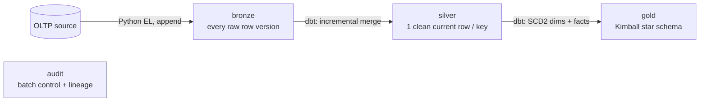
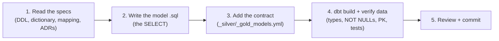
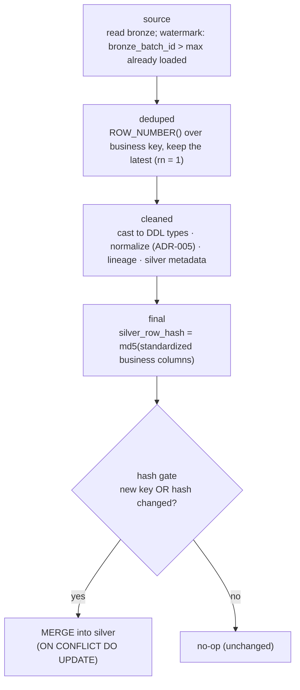
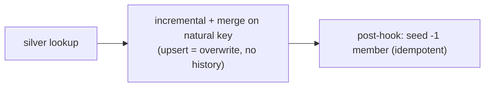
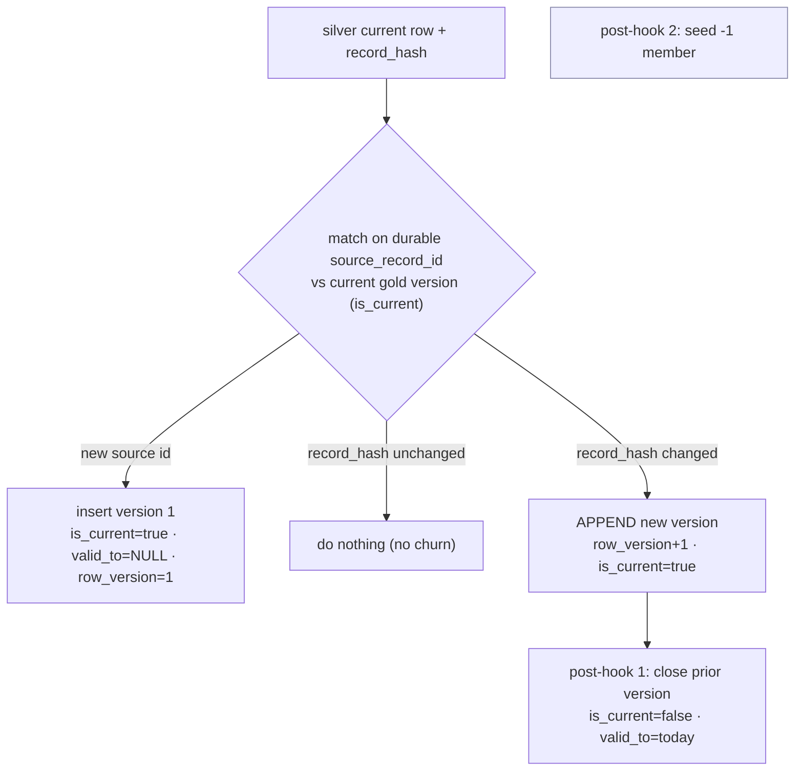
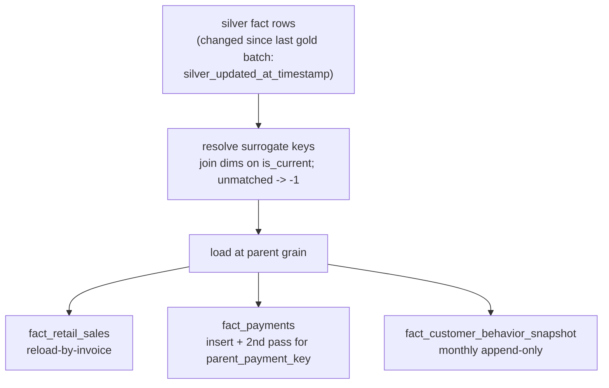

# dbt Transformation Flow — Silver & Gold

PrintTimeUSA Data Warehouse. How data is transformed from bronze → silver → gold in dbt,
and the exact per-model workflow. Companion to `dbt_decisions.md` (the running decision log)
and `PrintTimeUSA_dbt_Build_Guide.docx` (the from-scratch build guide).

---

## 1. The medallion arc

Python owns Extract + Load (OLTP → bronze). dbt owns every transformation from bronze onward.



| Layer | dbt materialization | Keeps |
|---|---|---|
| Bronze | `view` (source refs) | every raw source-row version (immutable history) |
| Silver | `incremental` + **merge** | one clean, current row per business key |
| Gold | mixed (table / **incremental append** / snapshot) | curated history (SCD2 dims) + immutable measurements (facts) |

---

## 2. The per-model workflow (identical for silver and gold)

Every model — silver or gold — is built with the same five steps.



- **Spec-first** (see the `dw-spec-first` skill): read the governing spec before writing; the spec wins over intuition.
- **The contract** enforces the DDL at build time — column names, data types, `NOT NULL`s, and the primary key — plus data tests (`unique`, `not_null`, `accepted_values`, `relationships`).
- **`dbt build`** runs the model *and* its tests in one step.

---

## 3. Silver transformation flow

Every silver model is one incremental-merge model with the same four-CTE shape. It turns
append-only bronze into one clean, current row per business key.



**Config (every silver model):**
```sql
{{ config(
    materialized='incremental',
    unique_key='silver_<entity>_id',
    incremental_strategy='merge',
    merge_exclude_columns=['silver_created_at_timestamp'],
    on_schema_change='fail'
) }}
```

**Key ideas** — deterministic dedup order (ADR-006), `record_hash` change detection (only real
changes update), contract with 7 NOT NULLs + PK, ADR-005 cleaning (casts, normalization,
lowercase status vocabularies, derived flags). *Reference model: `models/silver/state.sql`.*

---

## 4. Gold transformation flow

Gold reads **silver** (`{{ ref('silver_...') }}`, not `{{ source() }}`) and builds the star
schema. Unlike silver, gold uses **different strategies per table** — and adds **surrogate keys**,
**SCD2 history**, and a **`-1` Not Provided member**. Complexity ramps up in four tiers.

### 4a. Tier 0 — `dim_date` (Type 0, generate)
Simplest: no source, no SCD2. `materialized='table'`, generated with `generate_series`, plus a
`-1` member via `UNION ALL`. *Model: `models/gold/dim_date.sql`.*

### 4b. Tier 1 — Type 1 dimension (`dim_payment_type`)
Overwrite-on-change, like silver's merge — but adds a surrogate key and a `-1` member.


### 4c. Tier 2 — Type 2 (SCD2) dimensions — the ADR-015 pattern
Track history: never overwrite; append a new version and close the old one.

**Config (Type 2 dims):** `materialized='incremental'`, `incremental_strategy='append'`, a
post-hook to close superseded versions (the `-1` member is a literal `UNION ALL` row, not a
post-hook seed). Append — not merge — because
merge would overwrite the prior row and collapse Type 2 into Type 1. Surrogate keys are
dbt-managed plain `INTEGER`s (decision #7) — existing keys preserved from `{{ this }}`, new rows
`max(key) + running count` — so they stay stable across runs (facts reference them); the `-1`
member is a literal `UNION ALL` row in the model. *See ADR-015.*

### 4d. Tier 3 — Facts
Facts carry no SCD2. They **look up** dimension surrogate keys (current version) and load at
their parent grain, incrementally.

Change detection: `silver_updated_at_timestamp` vs. the last successful gold batch in
`audit.etl_batch_control` (gold's watermark). *See `gold_load_strategy.md`.*

---

## 5. Silver vs Gold at a glance

| Aspect | Silver | Gold |
|---|---|---|
| Reads from | bronze (`{{ source() }}`) | silver (`{{ ref() }}`) |
| Primary key | business key (natural) | **surrogate key** (identity) — dims; smart key — `dim_date` |
| Row per key | exactly one (current) | **many versions** (Type 2 dims); one (Type 1); N/A (facts) |
| Write mode | `incremental` + **merge** (upsert) | `table` / `incremental` **append** / snapshot |
| History | none (current only) | **SCD2** in the Type 2 dims |
| Change signal | `bronze_batch_id` watermark | `silver_updated_at_timestamp` vs. last gold batch |
| Special member | — | **`-1` "Not Provided"** (ADR-011) |
| Extra logic | — | post-hooks (close SCD2 versions, seed `-1`), key lookups |
| Contract file | `_silver_models.yml` | `_gold_models.yml` |

---

## 6. Where things live

```
dbt/printtime_dw/
  models/
    bronze/_bronze_sources.yml     source declarations + freshness SLA
    silver/
      _silver_models.yml           contracts + data tests
      <entity>.sql                 4-CTE incremental-merge models (20)
    gold/
      _gold_models.yml             contracts + data tests
      dim_date.sql                 Type 0 (generated)
      dim_*.sql / fact_*.sql       Type 1/2 dims + facts (in progress)
docs/
  adr/                             ADR-005/006 (silver), ADR-007/010/011/015 (gold)
  load_strategy/                   silver_incremental_merge_strategy.md, gold_load_strategy.md
  data_dictionary/                 per-column definitions (silver, gold)
  source_to_dw_mapping/            Bronze→Silver, Silver→Gold
sql/                               authoritative DDL specs (the contract source of truth)
```
